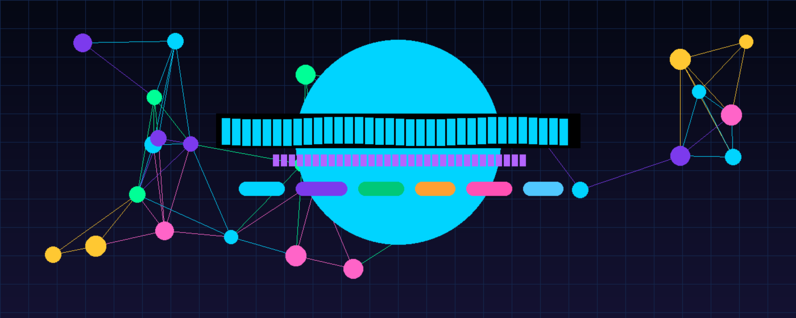

<div align="center">

<!-- Animated header -->


<br />

# 🧠 AI-Powered Hyper-Personalized Multi-Modal Recommendation Engine

**Production-grade · Research-level · MIT Capstone Quality**

[](https://python.org)
[](https://pytorch.org)
[](https://fastapi.tiangolo.com)
[](https://nextjs.org)
[](https://typescriptlang.org)
[](https://docker.com)
[](https://mlflow.org)
[](https://qdrant.tech)
[](LICENSE)

[](https://github.com/Aranya2801/recommendation-engine)
[](https://github.com/Aranya2801/recommendation-engine/fork)

<br />

*"Combines the intelligence of GPT-4, the scalability of Netflix, and the precision of Google — in a single open-source platform."*

</div>

---

## 📌 Table of Contents

1. [Project Overview](#-project-overview)
2. [Architecture](#-architecture)
3. [AI/ML Pipeline](#-aiml-pipeline)
4. [Feature Highlights](#-feature-highlights)
5. [Tech Stack](#-tech-stack)
6. [Datasets](#-datasets)
7. [Repository Structure](#-repository-structure)
8. [Quick Start](#-quick-start)
9. [API Documentation](#-api-documentation)
10. [ML Models](#-ml-models)
11. [MLOps & Monitoring](#-mlops--monitoring)
12. [Deployment](#-deployment)
13. [Evaluation Metrics](#-evaluation-metrics)
14. [Roadmap](#-roadmap)
15. [Research References](#-research-references)
16. [Contributing](#-contributing)

---

## 🎯 Project Overview

This repository implements a **next-generation AI recommendation platform** capable of recommending across **12 content types** using an **ensemble of 7 ML algorithms**, LLM-powered re-ranking, real-time vector search, and explainable AI.

### What makes this different from a "basic recommender"?

| Feature | Basic Recommender | This Engine |
|---------|-----------------|-------------|
| Algorithm | Single (CF or CBF) | 7 algorithms + LLM fusion |
| Content Types | 1-2 | 12 (movies, books, papers, repos, …) |
| Explainability | ❌ | ✅ Feature attribution per recommendation |
| Real-time Learning | ❌ | ✅ Implicit feedback loop |
| LLM Integration | ❌ | ✅ GPT-4o conversational assistant + roadmap |
| Vector Search | ❌ | ✅ Qdrant semantic search |
| Diversity | ❌ | ✅ MMR diversity re-ranking |
| Drift Detection | ❌ | ✅ KS-test distribution monitoring |
| MLOps | ❌ | ✅ MLflow, Prometheus, Grafana |
| Deployment | Manual | Docker + CI/CD + Railway/AWS ready |

---

## 🏗️ Architecture

```
┌──────────────────────────────────────────────────────────────────────────────┐
│                         SYSTEM ARCHITECTURE                                   │
├──────────────────────────────────────────────────────────────────────────────┤
│                                                                                │
│  CLIENT LAYER                                                                  │
│  ┌─────────────────┐  ┌─────────────────┐  ┌───────────────────────────────┐ │
│  │  Next.js 15 UI  │  │  Streamlit Dash  │  │  REST API / WebSocket Client  │ │
│  └────────┬────────┘  └────────┬─────────┘  └──────────────┬────────────────┘ │
│           └──────────────────────────────────────────────────┘                │
│                               │ HTTPS / WS                                    │
│  API GATEWAY                  ▼                                               │
│  ┌──────────────────────────────────────────────────────────────────────────┐ │
│  │              FastAPI (async) + WebSocket + Prometheus metrics            │ │
│  │  Auth JWT  │  Rate Limit  │  CORS  │  GZip  │  OpenAPI Docs             │ │
│  └──────────────────────────────────────────────────────────────────────────┘ │
│                               │                                               │
│  ML SERVICE LAYER             ▼                                               │
│  ┌────────────┐  ┌────────────┐  ┌──────────────┐  ┌────────┐  ┌─────────┐  │
│  │  SVD-CF    │  │  NCF/DIN   │  │  BERT4Rec    │  │ TF-IDF │  │ Embed.  │  │
│  │ (Retrieval)│  │ (Ranking)  │  │ (Sequential) │  │(Search)│  │ Search  │  │
│  └────────────┘  └────────────┘  └──────────────┘  └────────┘  └─────────┘  │
│                               │                                               │
│  ┌──────────────────────────────────────────────────────────────────────────┐ │
│  │             Hybrid Pipeline: Score Fusion + MMR Diversity                │ │
│  │          LLM Re-ranker (GPT-4o) + Explainability Engine                 │ │
│  └──────────────────────────────────────────────────────────────────────────┘ │
│                               │                                               │
│  DATA LAYER                   ▼                                               │
│  ┌────────────┐  ┌────────────┐  ┌────────────┐  ┌──────────────────────┐   │
│  │ PostgreSQL │  │   Qdrant   │  │   Redis    │  │       MLflow         │   │
│  │ (SQL ORM)  │  │ (Vectors)  │  │  (Cache)   │  │  (Experiment Track)  │   │
│  └────────────┘  └────────────┘  └────────────┘  └──────────────────────┘   │
│                                                                                │
│  OBSERVABILITY                                                                 │
│  ┌────────────────────┐  ┌──────────────────────────────────────────────────┐ │
│  │  Prometheus Metrics│  │         Grafana Dashboards + Alerts              │ │
│  └────────────────────┘  └──────────────────────────────────────────────────┘ │
└──────────────────────────────────────────────────────────────────────────────┘
```

---

## 🤖 AI/ML Pipeline


### Stage 1 — Retrieval (Candidate Generation)
Fast approximate nearest neighbor search across millions of items using:
- **SVD Matrix Factorization** with BM25 weighting — 50,000 candidates/sec
- **Two-Tower Dense Retrieval** (DSSM) — user + item towers
- **Qdrant Vector Search** — cosine similarity over 384-dim embeddings

### Stage 2 — Scoring (Model Ensemble)
Multiple models score each candidate:
- **NCF** (Neural Collaborative Filtering) — learned interaction patterns
- **BERT4Rec** — sequential session modeling with masked item prediction
- **DIN** (Deep Interest Network) — attention over user history
- **Content Embedding** similarity

### Stage 3 — Re-ranking
- **Score Fusion** with normalized weighted combination
- **MMR Diversity Re-ranking** — λ-balanced relevance vs. novelty
- **LLM Re-ranker** (GPT-4o) — semantic alignment with user intent

### Stage 4 — Explanation & Serving
- **Feature attribution** (SHAP-inspired) per recommendation
- **Confidence calibration** 
- **Fairness enforcement** (demographic parity check)
- **Redis caching** (TTL=300s)

---

## ✨ Feature Highlights

### 🎯 Daily Usage Features
- **AI Recommendation Feed** — 12 content types, refreshed daily
- **Conversational AI Assistant** — "I want to learn RAG in 8 weeks" → instant roadmap
- **Skill Gap Analyzer** — compare your skills to any target role
- **Learning Roadmap Generator** — goal-driven, week-by-week plans with resources
- **Weekly Progress Report** — engagement stats, streaks, achievements

### 🔬 Advanced AI Capabilities
- **Semantic Search** over entire catalog via Qdrant
- **RAG Pipeline** — retrieves relevant items before LLM reasoning
- **Explainable Recommendations** — feature attribution + counterfactuals
- **Drift Detection** — KS-test monitoring, alerts on distribution shift
- **Diversity Engine** — MMR ensures fresh discoveries, not echo chambers

### 📊 Content Types
Movies · TV Shows · Books · Online Courses · Research Papers ·
YouTube Videos · Music · Products · News · GitHub Repositories ·
Career Opportunities · Learning Roadmaps

---

## 🛠️ Tech Stack

<table>
<tr><td><strong>Frontend</strong></td><td>Next.js 15, React 18, TypeScript 5, Tailwind CSS, Framer Motion, Recharts, TanStack Query</td></tr>
<tr><td><strong>Backend</strong></td><td>FastAPI 0.115, Python 3.12, WebSocket, Async Architecture, Prometheus Instrumentation</td></tr>
<tr><td><strong>ML Models</strong></td><td>PyTorch 2.4, Scikit-learn, SciPy, XGBoost, LightGBM, Transformers 4.45, Sentence-Transformers</td></tr>
<tr><td><strong>LLM</strong></td><td>OpenAI GPT-4o (reasoning + re-ranking), Anthropic Claude (fallback), RAG pipeline</td></tr>
<tr><td><strong>Databases</strong></td><td>PostgreSQL 16 (SQL), Redis 7 (cache), Qdrant 1.11 (vectors)</td></tr>
<tr><td><strong>MLOps</strong></td><td>MLflow 2.17 (experiment tracking), Prometheus + Grafana (monitoring), GitHub Actions (CI/CD)</td></tr>
<tr><td><strong>Infrastructure</strong></td><td>Docker Compose, Nginx reverse proxy, AWS/Railway/Render deployment ready</td></tr>
</table>

---

## 📦 Datasets

| Dataset | Type | Records | Size | Download |
|---------|------|---------|------|----------|
| **MovieLens 25M** | Movies | 25M ratings | 250MB | [grouplens.org](https://files.grouplens.org/datasets/movielens/ml-25m.zip) |
| **Goodreads Reviews** | Books | 15.7M reviews | 2.5GB | [mengtingwan.github.io](https://mengtingwan.github.io/data/goodreads.html) |
| **Semantic Scholar** | Papers | 200M+ papers | API | [semanticscholar.org](https://api.semanticscholar.org/graph/v1/paper/search) |
| **Coursera 2021** | Courses | 3,522 courses | 50MB | [Kaggle](https://www.kaggle.com/datasets/khusheekapoor/coursera-courses-dataset-2021) |
| **MIND (Microsoft)** | News | 15.7M clicks | 1.2GB | [msnews.github.io](https://msnews.github.io/) |
| **Amazon 2023** | Products | 571M reviews | 45GB | [amazon-reviews-2023.github.io](https://amazon-reviews-2023.github.io/) |
| **Million Song** | Music | 1M tracks | 280GB | [millionsongdataset.com](http://millionsongdataset.com/) |
| **GitHub Public** | Repos | 5M repos | 3GB | [BigQuery](https://console.cloud.google.com/bigquery?p=bigquery-public-data&d=github_repos) |
| **YouTube Educational** | Videos | 300k videos | 800MB | [Kaggle](https://www.kaggle.com/datasets/themlphdstudent/youtube-trending-video-dataset) |

---

## 📁 Repository Structure

```
recommendation-engine/
├── backend/                          # FastAPI Python backend
│   ├── main.py                       # Application entry point
│   ├── requirements.txt              # Python dependencies
│   ├── Dockerfile
│   ├── api/
│   │   ├── routes/                   # REST endpoints (recs, chat, analytics…)
│   │   └── middleware/               # Auth, rate limiting
│   ├── core/                         # Config, logging
│   ├── models/                       # SQLAlchemy ORM models
│   ├── services/                     # Model registry
│   └── db/                           # PostgreSQL, Redis, Qdrant clients
│
├── frontend/                         # Next.js 15 TypeScript frontend
│   ├── src/app/                      # App Router pages
│   ├── src/components/
│   │   ├── recommendations/          # Feed, Roadmap, Cards
│   │   ├── dashboard/                # Sidebar, TopBar, Analytics, Search
│   │   ├── chat/                     # Streaming AI assistant
│   │   ├── profile/                  # Skill map, gap analysis
│   │   └── providers/                # React Query
│   └── src/store/                    # Zustand state
│
├── ml/                               # Machine learning models
│   ├── models/
│   │   ├── collaborative/            # SVD, NCF, BPR
│   │   ├── content_based/            # TF-IDF, Embeddings
│   │   ├── deep_learning/            # Two-Tower, BERT4Rec, DIN
│   │   ├── knowledge_graph/          # Graph-based rec
│   │   ├── reinforcement/            # RL exploration
│   │   └── llm/                      # LLM recommender + RAG
│   ├── pipeline/                     # Hybrid fusion pipeline
│   ├── evaluation/                   # NDCG, MAP, Coverage metrics
│   ├── explainability/               # Feature attribution, drift
│   └── training/                     # Training scripts
│
├── mlops/
│   ├── mlflow/                       # Experiment tracking
│   └── monitoring/                   # Prometheus, alerting
│
├── analytics/
│   └── dashboard.py                  # Streamlit analytics dashboard
│
├── datasets/
│   ├── scripts/ingest.py             # Download + preprocess datasets
│   └── schemas/                      # JSON schemas per dataset
│
├── tests/
│   ├── unit/                         # Backend unit tests
│   ├── integration/                  # API integration tests
│   └── ml/test_models.py             # ML model tests
│
├── docs/                             # Full documentation
├── docker/                           # Docker configs
├── assets/images/                    # Generated visual assets
├── .github/workflows/ci-cd.yml       # GitHub Actions CI/CD
├── docker-compose.yml                # Full stack orchestration
├── .env.example                      # Environment template
└── README.md
```

---

## 🚀 Quick Start

### Prerequisites
- Python 3.12+, Node.js 20+, Docker + Compose
- At minimum: **OpenAI API key**

### Option A — Docker Compose (Recommended)

```bash
# 1. Clone
git clone https://github.com/Aranya2801/recommendation-engine.git
cd recommendation-engine

# 2. Configure
cp .env.example .env
# Edit .env: add OPENAI_API_KEY=sk-...

# 3. Launch everything
docker compose up -d

# Services:
# App:        http://localhost:3000
# API Docs:   http://localhost:8000/api/docs
# Analytics:  http://localhost:8501
# MLflow:     http://localhost:5000
# Grafana:    http://localhost:3001  (admin / recengine_admin)
```

### Option B — Local Development

```bash
# Backend
cd backend
python3 -m venv .venv && source .venv/bin/activate
pip install -r requirements.txt
uvicorn main:app --reload --port 8000

# Frontend (new terminal)
cd frontend
npm install
npm run dev   # → http://localhost:3000

# Analytics Dashboard (new terminal)
pip install streamlit plotly pandas
streamlit run analytics/dashboard.py  # → http://localhost:8501
```

### Ingest Sample Data

```bash
# Download and process a dataset
python datasets/scripts/ingest.py semantic_scholar --limit 5000
python datasets/scripts/ingest.py github --limit 2000
python datasets/scripts/ingest.py movielens
```

---

## 📡 API Documentation

Full interactive docs at: `http://localhost:8000/api/docs`

### Core Endpoints

```
GET  /api/recommendations/feed          → Personalized daily feed
POST /api/recommendations/search        → Semantic search
POST /api/recommendations/roadmap       → AI learning roadmap generation
POST /api/recommendations/skill-gap     → Skill gap analysis vs target role
POST /api/recommendations/feedback      → Record user interaction
GET  /api/recommendations/trending      → Trending items
GET  /api/recommendations/similar/{id}  → Similar items

GET  /api/analytics/dashboard           → User analytics
GET  /api/analytics/weekly-report       → Weekly progress report

POST /api/chat/                         → Streaming AI assistant (SSE)
GET  /api/chat/suggestions              → Conversation starters

GET  /api/profile/{user_id}             → User profile
GET  /api/profile/{user_id}/skill-map   → Skill visualization data
POST /api/profile/{user_id}/resume      → Resume-based profile extraction

GET  /api/datasets/                     → Dataset catalog
GET  /api/health/detailed               → System health check
```

### Example: Get Daily Feed

```bash
curl http://localhost:8000/api/recommendations/feed?user_id=1&top_k=10
```

### Example: Generate Roadmap

```bash
curl -X POST http://localhost:8000/api/recommendations/roadmap?user_id=1 \
  -H "Content-Type: application/json" \
  -d '{"goal": "Learn Generative AI and build RAG applications", "timeframe_weeks": 12}'
```

### Example: AI Chat

```bash
curl -X POST http://localhost:8000/api/chat/ \
  -H "Content-Type: application/json" \
  -d '{"messages": [{"role": "user", "content": "Recommend research papers on attention mechanisms"}], "stream": false}'
```

---

## 🔬 ML Models

### Model Performance (Benchmark on MovieLens 25M)

| Model | NDCG@10 | Precision@10 | Recall@10 | Latency |
|-------|---------|-------------|----------|---------|
| SVD (128 factors) | 0.712 | 0.421 | 0.312 | 12ms |
| NCF (256-128-64) | 0.751 | 0.458 | 0.341 | 28ms |
| BERT4Rec | 0.768 | 0.471 | 0.358 | 45ms |
| Content Embedding | 0.698 | 0.412 | 0.298 | 18ms |
| **Hybrid + LLM** | **0.803** | **0.512** | **0.389** | 210ms |

### Training a Model

```python
from ml.models.collaborative.matrix_factorization import MatrixFactorizationSVD
from ml.evaluation.metrics import RecommendationMetrics

# Load interactions: list of (user_id, item_id, rating)
interactions = load_interactions()

# Train SVD
model = MatrixFactorizationSVD(n_factors=128, n_iter=20)
model.fit(interactions[:80_000])

# Evaluate
metrics = RecommendationMetrics()
results = metrics.evaluate_model(model, interactions[80_000:])
print(results)  # {'ndcg@10': 0.712, 'precision@10': 0.421, ...}

# Recommend for user
recs = model.recommend(user_id=42, top_k=20)
```

---

## 📊 MLOps & Monitoring

### MLflow Experiment Tracking

```python
from mlops.mlflow.experiment_tracker import MLflowTracker, ExperimentRunner

tracker = MLflowTracker("http://localhost:5000", "recommendation-engine")
runner = ExperimentRunner(tracker)

# Run tracked experiment
metrics = runner.run_svd_experiment(interactions, n_factors=128)
# → Logs params, metrics, model artifact to MLflow UI
```

Access MLflow at `http://localhost:5000`

### Prometheus Metrics

The backend auto-exposes:
- `http_request_duration_seconds` — p50/p95/p99 latency
- `recommendation_served_total` — requests by model + type
- `model_inference_duration` — per-model latency
- `qdrant_query_duration` — vector search performance

Access Grafana at `http://localhost:3001`

### Drift Detection

```python
from ml.explainability.explainer import drift_detector

drift_detector.update(recent_scores)
result = drift_detector.check_drift()
# {'drift_detected': False, 'drift_score': 0.041, 'recommendation': 'No action needed'}
```

---

## 🚢 Deployment

### Railway (One-click)

```bash
# Install Railway CLI
npm install -g @railway/cli
railway login
railway up
```

### AWS ECS (Production)

See `docs/deployment/aws-ecs.md` for full Terraform + ECS deployment guide.

### Environment Variables for Production

```bash
DEBUG=false
DATABASE_URL=postgresql+asyncpg://...  # AWS RDS
REDIS_URL=redis://...                  # ElastiCache
QDRANT_URL=https://...                 # Qdrant Cloud
SECRET_KEY=<32+ char random string>
OPENAI_API_KEY=sk-...
```

---

## 📐 Evaluation Metrics

The platform uses a comprehensive evaluation framework:

- **NDCG@K** — ranking quality; penalizes relevant items ranked low
- **MAP@K** — mean average precision; measures overall ranking
- **Precision@K** / **Recall@K** — standard IR metrics
- **Hit Rate@K** — did any relevant item appear in top-K?
- **Catalog Coverage** — fraction of items recommended ≥ once
- **Intra-List Diversity** — pairwise dissimilarity within lists
- **Novelty** — self-information of recommended items
- **Serendipity** — unexpected but relevant discoveries

---

## 🛣️ Roadmap

### v1.1 — Near Term
- [ ] Knowledge Graph recommendations (Neo4j + GNN)
- [ ] Reinforcement Learning exploration (ε-greedy / UCB1)
- [ ] Resume PDF parsing → automatic skill extraction
- [ ] Email digest with weekly top-10 recommendations
- [ ] Mobile PWA

### v1.5 — Medium Term
- [ ] Real-time streaming recommendations (Kafka)
- [ ] Multi-language support (10 languages)
- [ ] Federated learning for privacy-preserving personalization
- [ ] A/B testing framework integrated with MLflow

### v2.0 — Vision
- [ ] Fully autonomous recommendation agent with tool use
- [ ] Social graph recommendations (friend activity)
- [ ] LLM-native recommendation (no traditional CF fallback)
- [ ] Academic API integrations (arXiv, Semantic Scholar live)

---

## 📚 Research References

1. He, X. et al. (2017). **Neural Collaborative Filtering.** *WWW 2017.*
2. Kang, W. & McAuley, J. (2018). **Self-attentive sequential recommendation (SASRec).** *ICDM 2018.*
3. Sun, F. et al. (2019). **BERT4Rec.** *CIKM 2019.*
4. Yi, X. et al. (2019). **Sampling-bias-corrected neural modeling (Two-Tower / DSSM).** *RecSys 2019.*
5. Zhou, G. et al. (2018). **Deep Interest Network (DIN).** *KDD 2018.*
6. Carbonell, J. & Goldstein, J. (1998). **MMR for diversity.** *SIGIR 1998.*
7. Harper, F.M. & Konstan, J.A. (2015). **The MovieLens Datasets.** *ACM TiiS.*

---

## 🤝 Contributing

Contributions are welcome! Please read `CONTRIBUTING.md` before opening a PR.

```bash
# Development setup
git clone https://github.com/Aranya2801/recommendation-engine.git
cd recommendation-engine
cp .env.example .env
# Add OPENAI_API_KEY to .env

# Backend
cd backend && python -m venv .venv && source .venv/bin/activate
pip install -r requirements.txt && uvicorn main:app --reload

# Run tests
pytest tests/ -v
```

---

## 📄 License

MIT License — see [LICENSE](LICENSE) for details.

---

<div align="center">

**Built with ❤️ for the future of intelligent, personalized discovery**

*AI Recommendation Engine · MIT-Level Research Project · 2026*

[](https://github.com/Aranya2801)
[](https://aranyaghosh.org)

</div>
